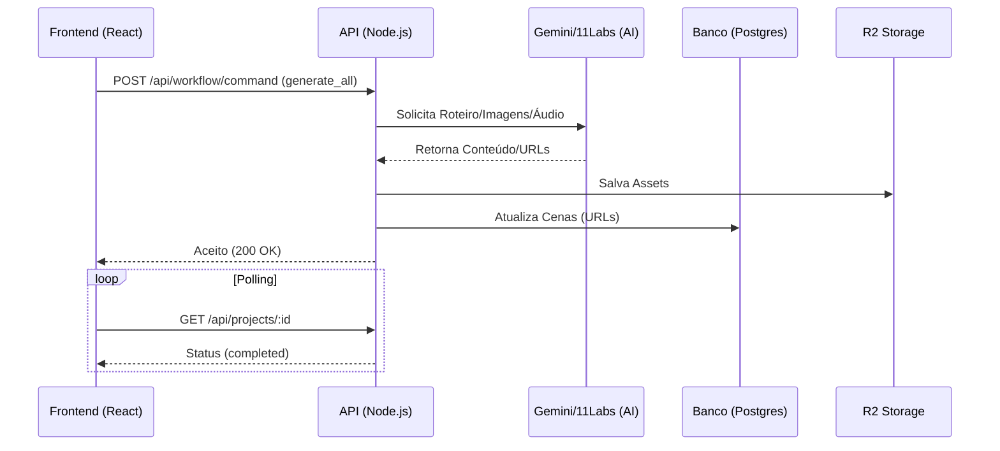
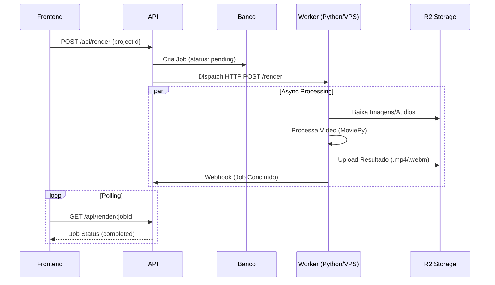
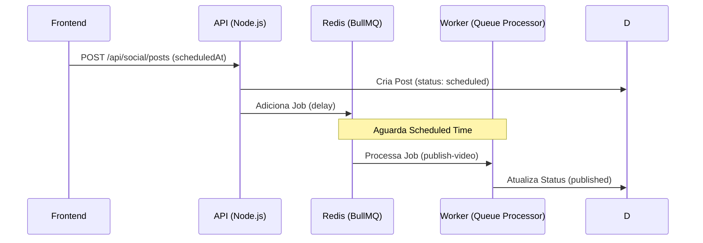

# 🏗️ Arquitetura do Sistema ShortsAI

Este documento descreve a arquitetura de serviços distribuídos em produção.

## 🏢 Visão Geral (High Level)

O sistema é composto por 3 partes principais:

1.  **Frontend (Studio)**: Single Page Application (React/Vite).
2.  **Backend (API)**: API RESTful (Next.js App Router).
3.  **Worker (Video Engine)**: Microsserviço de renderização (Python/MoviePy).

---

## 🔄 Fluxo de Dados (Data Flow)

### 1. Geração de Assets (IA)
O frontend solicita a geração, mas a lógica pesada ocorre no backend.

### 2. Renderização de Vídeo (Pipeline de Exportação)
Processo assíncrono delegado ao Worker.

### 3. Agendamento de Postagens (Social Media)
Orquestração via Fila de Mensagens (BullMQ).

---

## 🧩 Componentes

### Frontend (`shortsai-studio`)
- **Tech**: React 19, Vite, TailwindCSS.
- **Responsabilidade**: Interface, Edição de Roteiro, Preview, Solicitação de Geração.
- **Modos**:
  - `Mock`: Usa dados locais para testes de UI.
  - `Prod`: Conecta na API via `/api/*`.

### Backend API (`shortsai-api`)
- **Tech**: Next.js 15, Prisma, PostgreSQL.
- **Responsabilidade**: Regras de negócio, Gestão de Créditos, Proxy de R2, Orquestração de IA.
- **Hospedagem**: VPS (Docker Compose).

### Worker (`shortsai-api/worker`)
- **Tech**: Python 3.11, FastAPI, MoviePy.
- **Responsabilidade**: Renderização de vídeo intensiva (CPU Bound).
- **Hospedagem**: VPS (Docker Compose).
- **Nota**: Código compatível com Cloud Run (Serverless) para escala futura, mas rodando localmente por questões de performance/custo.

### Armazenamento
- **Banco**: PostgreSQL (Dados relacionais).
- **Blob**: Cloudflare R2 (Imagens, Áudio, Vídeo).
